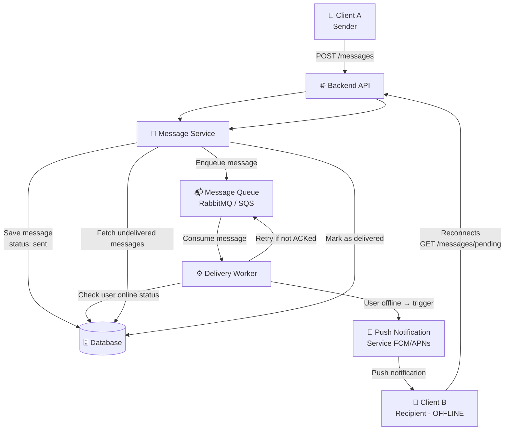
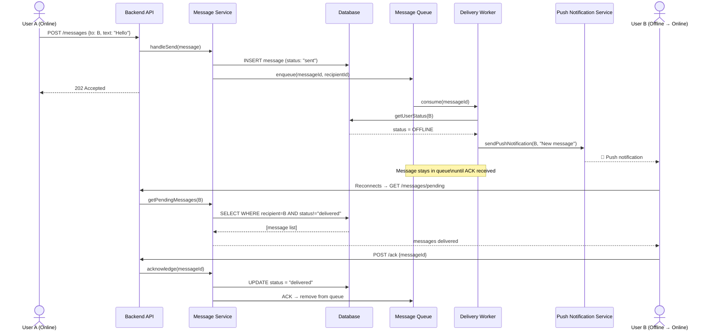
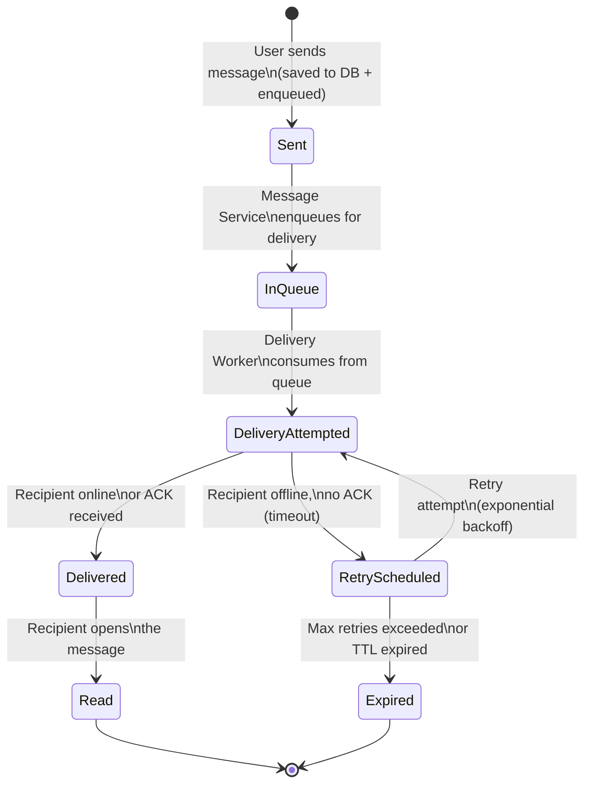

# 🧪 Laboratory Work 1 — Variant 3: Offline Message Delivery

**Student:** *(Your Name)*
**Variant:** 3 — Offline Message Delivery
**Focus:** Asynchronous delivery, message persistence, retry strategy

---

## 🧩 Context

This variant focuses on a scenario where users can be **offline for long periods of time**.
The system must guarantee that **no messages are lost**, and deliver them reliably once the user reconnects.

Key engineering questions:
- Queue vs polling — what delivery mechanism to use?
- What is the retry strategy when delivery fails?
- How long should messages be retained?

---

## 🧱 Part 1 — Component Diagram

### Components and their responsibilities

| Component | Responsibility |
|---|---|
| **Client (Web/Mobile)** | Send/receive messages, show delivery status, reconnect and poll on startup |
| **Backend API** | Accept incoming messages, authenticate users, route requests |
| **Message Service** | Core business logic: save messages, enqueue for delivery, update status |
| **Message Queue** | Buffer messages for offline users; guarantees at-least-once delivery |
| **Delivery Worker** | Background process: reads from queue, attempts delivery, handles retries |
| **Database** | Persistent storage for messages, user status, delivery records |
| **Push Notification Service** | Notify offline users (FCM/APNs) so they reconnect and fetch messages |

### Diagram

---

## 🔁 Part 2 — Sequence Diagram

### Scenario: User A sends a message to User B who is offline

---

## 🔄 Part 3 — State Diagram

### Object: Message

### State descriptions

| State | Description |
|---|---|
| **Sent** | Message saved to DB, delivery not yet attempted |
| **InQueue** | Message is buffered in the queue, waiting for delivery |
| **DeliveryAttempted** | Delivery Worker tried to deliver the message |
| **Delivered** | Recipient received and acknowledged the message |
| **RetryScheduled** | Delivery failed; retry is pending (exponential backoff) |
| **Expired** | Max retries exceeded or TTL reached; message undeliverable |
| **Read** | Recipient opened the message |

---

## 📚 Part 4 — ADR (Architecture Decision Record)

---

### ADR-001: Use Message Queue for Offline Delivery

**Status:** Accepted

**Context:**
Users can be offline for extended periods (hours or days). When User A sends a message to offline User B, the system must not lose the message. Direct WebSocket delivery would fail silently if the recipient is disconnected. A reliable buffer mechanism is needed.

**Decision:**
Use a **Message Queue** (e.g., RabbitMQ or AWS SQS) as the delivery buffer.
- When a message is sent, it is immediately enqueued.
- A **Delivery Worker** consumes from the queue and attempts delivery.
- The message is removed from the queue **only after receiving an explicit ACK** from the recipient's client.
- If no ACK arrives within a timeout, the message is re-queued with **exponential backoff**.

**Alternatives Considered:**

| Alternative | Why Rejected |
|---|---|
| Direct WebSocket delivery only | Fails completely if user is offline; no persistence |
| Client polling (HTTP long-poll) | Wastes resources; high latency; complex to scale |
| Database polling by worker | Simpler but less efficient; harder to scale horizontally |

**Consequences:**

✅ Messages are never lost — guaranteed by queue persistence  
✅ Delivery is decoupled from user online status  
✅ Horizontal scaling of Delivery Workers is straightforward  
⚠️ Increased system complexity (new infrastructure component)  
⚠️ At-least-once delivery requires idempotent message handling on the client  
⚠️ Queue TTL must be configured to avoid infinite retention  

---

### ADR-002: Retry Strategy with Exponential Backoff

**Status:** Accepted

**Context:**
If a message delivery attempt fails (user still offline, push notification not triggered), the Delivery Worker must retry. Naïve immediate retries would overload the system.

**Decision:**
Use **exponential backoff** for retries:
- 1st retry: after 30 seconds
- 2nd retry: after 2 minutes
- 3rd retry: after 10 minutes
- Nth retry: up to a configured max (e.g., 7 days TTL)

After TTL expiration, the message is marked **Expired** and removed from the queue. The sender may optionally be notified.

**Consequences:**

✅ Reduces unnecessary load on the system  
✅ Gives users reasonable time to reconnect  
⚠️ Messages may arrive with noticeable delay for long-offline users  
⚠️ TTL policy must be documented and communicated to users  
